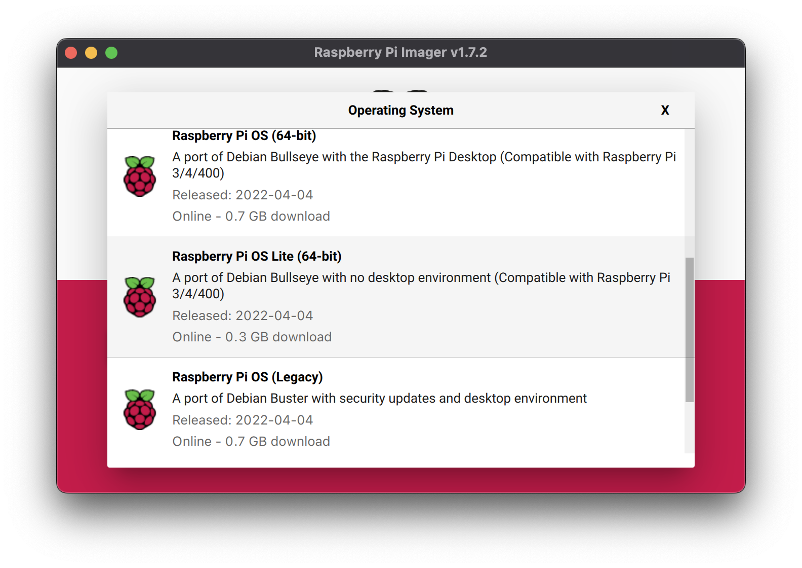
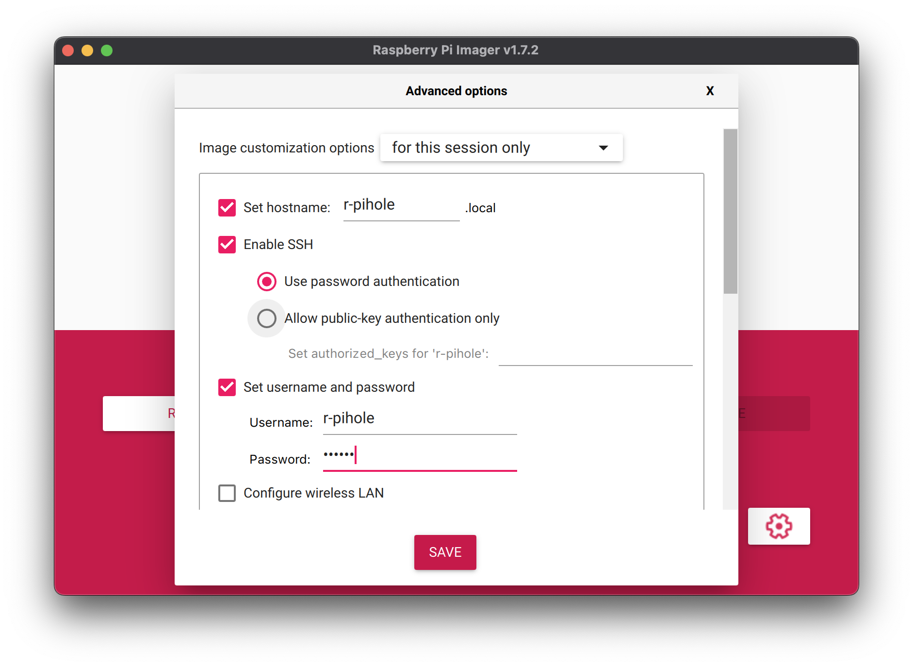

# KubePiHole is a CLI tool for quick and painless Pi-hole deployment

First off, Pi-hole rocks! Big thanks and shout out to the developers.

Second of all, Pi-hole is great for protecting your local network, and benefiting from faster DNS resolution than is possible with any upstream configuration (at least in the mid to long term, once the cache is built).

DNS is often trusted to practically random third parties, which can mean slow resolution, leading to increased page load times online (for example). Even if you use a solid provider like Cloudflare or Google and experience little performance impact, there are privacy concerns.

Pi-hole is designed to be installed on a Raspberry Pi (any version, at least model B 2 and above!) running the Raspberry Pi OS. Among other things, it can filter ads across your entire network. It's also useful for blocking known malicious domains. (More on this later.)

## Reasoning

I'm fairly technical, my day job is coding. Even I have struggled with issues with running just a single Pi with Pi-hole installed, but I do not blame Pi-hole for this. It's partly because I'm running an old Pi atm, and have quite a lot of domains filtered. It works great.

But once or twice the power tripped (due to power cuts) and the Pi didn't work after that because it caused corruption to the install. You could get around this issue by deploying remotely, but I prefer the local network install. This has left me Pi-hole-less for too long and I figured deploying this with Kubernetes would be lovely because it can support redundancy more easily and be easier to re-deploy.

## Complete guide

Since I'm sure it can be a bit daunting at first with Pi-hole if you're not very technical, I want to provide a complete guide for doing this so hopefully almost anyone can do this if they're willing to spend 30 minutes setting things up!

### What you'll need

To get started, here's what you'll need:

- 1x Raspberry Pi (ideally model 3 or above, since they support 64 bit)
- 1x SD card
- 1x Computer with SD card reader

### Steps

Plug the SD card into your computer.

Then, visit the official Raspberry Pi website here:

- Raspberry Pi Official "Pi Imager" [https://www.raspberrypi.com/software/](https://www.raspberrypi.com/software/)
- Download the appropriate version for the system you are doing this from (Mac, Windows etc)
- Install it and open it

Click the left hand side button "CHOOSE OS" (under "Operating System").

You should see a list, select the Lite version in either 64 bit (Raspberry Pi 3 and above) or 32 bit (Raspberry Pi 2 and below).

Like so (set your own secure password for SSH, or if you know how, use keys):



Next, click the "CHOOSE STORAGE" button and select your SD card (you may need to format it first, if it's not there).

Once storage is selected a new cog icon button should appear in the bottom right hand corner, click it and enable SSH for the rest of the configuration:



"SAVE".

Then select "WRITE", it will take a few minutes.

## Once Pi Imager and the SD card is finished

Unplug your SD card and stick it in your Raspberry Pi. Ideally, connect the Raspberry Pi via Ethernet to your home router.

##  Set a static IP for your Pi

This part is mostly up to you, whatever router you run figure out how to identify your connected and powered up Pi and then set a static IP of your choosing for it.

## Connect to the Pi via SSH and get started with KubePiHole

Set an environment variable for the PI IP you set up as static on your local network (e.g. `192.1.1.100`):

```zsh
MY_PI_IP=192.1.1.100 # replace with your static IP!
```

From your preferred computer, open a terminal and connect to your Raspberry Pi via SSH:

```zsh
ssh r-pihole@$MY_PI_IP
```

Enter the password you chose earlier, and you should now have a live "shell" on your Raspberry Pi.

##  Install the only manual dependency required

The goal is for this to be as simple as possible to launch, so the only package we must install on a fresh Raspberry Pi OS Lite install is `git` (to clone this repo).

From the new SSH shell:

```zsh
sudo apt-get install git -y # -y skips the prompt and just installs what it needs to
```

## Clone this repository

If you're used to git, you probably already know how to do this since you're likely on the repo homepage now.

Just run:

```zsh
git clone https://github.com/Quasso/KubePiHole.git
cd KubePiHole
```